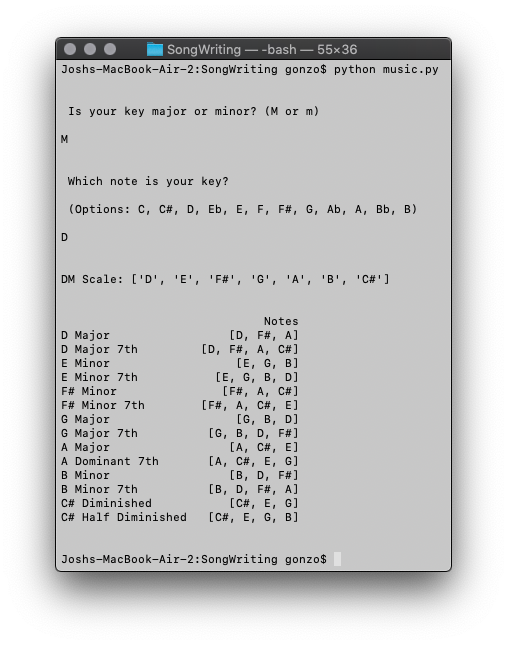

# SongWriting
Scripts to aid musical creation and songwriting

Music.py: I created this script because I was sick of using physical charts or googling to find scales or what chords fit in a key. This uses logic from music theory to display notes in the given scale and 14 of the common chords associated with the given key and the notes said chords are made of.

  

